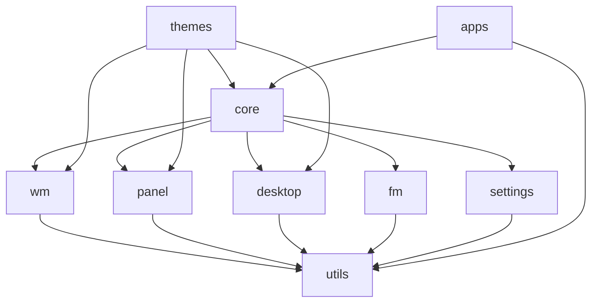

# Dowel-Steek Desktop Environment - Project Structure

## Project Overview
Dowel-Steek is a lightweight desktop environment written in D, designed as a modern alternative to XFCE with focus on performance, modularity, and customization through DML (DlangUI Markup Language).

## Core Architecture

### Module Organization

```
dowel-steek/
├── source/
│   ├── core/                    # Core desktop environment modules
│   │   ├── package.d            # Public API exports
│   │   ├── config.d             # Configuration management
│   │   ├── session.d            # Session management
│   │   ├── ipc.d                # Inter-process communication
│   │   ├── dbus.d               # D-Bus integration
│   │   └── protocols.d          # EWMH/ICCCM protocols
│   │
│   ├── wm/                      # Window Manager
│   │   ├── package.d
│   │   ├── manager.d            # Main window manager
│   │   ├── compositor.d         # Compositing manager
│   │   ├── decorations.d        # Window decorations
│   │   ├── layouts/             # Layout algorithms
│   │   │   ├── tiling.d
│   │   │   ├── floating.d
│   │   │   ├── stacking.d
│   │   │   └── tabbed.d
│   │   ├── actions.d            # Window actions (move, resize, etc.)
│   │   ├── shortcuts.d          # Keyboard shortcuts
│   │   └── switcher.d           # Alt+Tab implementation
│   │
│   ├── panel/                   # Panel/Taskbar System
│   │   ├── package.d
│   │   ├── panel.d              # Main panel widget
│   │   ├── taskbar.d            # Window buttons
│   │   ├── systray.d            # System tray
│   │   ├── launcher.d           # Application launcher
│   │   ├── workspace_switcher.d # Workspace switcher widget
│   │   ├── clock.d              # Clock widget
│   │   ├── applets/             # Panel applets/plugins
│   │   │   ├── volume.d
│   │   │   ├── network.d
│   │   │   ├── battery.d
│   │   │   ├── notifications.d
│   │   │   └── applet_api.d
│   │   └── panel_config.d       # Panel configuration
│   │
│   ├── desktop/                 # Desktop Management
│   │   ├── package.d
│   │   ├── desktop.d            # Main desktop widget
│   │   ├── wallpaper.d          # Wallpaper management
│   │   ├── icons.d              # Desktop icons
│   │   ├── context_menu.d       # Right-click menus
│   │   └── drag_drop.d          # Drag & drop support
│   │
│   ├── fm/                      # File Manager
│   │   ├── package.d
│   │   ├── explorer.d           # File explorer window
│   │   ├── tree_view.d          # Directory tree
│   │   ├── list_view.d          # File list view
│   │   ├── icon_view.d          # Icon view
│   │   ├── file_operations.d    # Copy/move/delete
│   │   ├── mime_handler.d       # File type handling
│   │   └── bookmarks.d          # Bookmarks/favorites
│   │
│   ├── settings/                # Settings Manager
│   │   ├── package.d
│   │   ├── manager.d            # Settings manager window
│   │   ├── appearance.d         # Theme/appearance settings
│   │   ├── display.d            # Display configuration
│   │   ├── keyboard.d           # Keyboard settings
│   │   ├── mouse.d              # Mouse/touchpad settings
│   │   ├── power.d              # Power management
│   │   ├── sound.d              # Audio settings
│   │   └── defaults.d           # Default applications
│   │
│   ├── themes/                  # Theming System
│   │   ├── package.d
│   │   ├── theme_engine.d       # Theme engine
│   │   ├── icon_theme.d         # Icon theme support
│   │   ├── cursor_theme.d       # Cursor theme support
│   │   └── dml/                 # DML theme definitions
│   │       ├── default.dml
│   │       └── dark.dml
│   │
│   ├── utils/                   # Utility modules
│   │   ├── package.d
│   │   ├── x11_helper.d         # X11 utilities
│   │   ├── wayland_helper.d     # Wayland utilities
│   │   ├── process_manager.d    # Process management
│   │   ├── notification.d       # Notification system
│   │   └── logger.d             # Logging utilities
│   │
│   └── apps/                    # Bundled applications
│       ├── terminal/
│       ├── notes/
│       ├── chatgpt/
│       └── launcher/
│
├── resources/                   # Resources
│   ├── icons/                  # Default icon set
│   ├── themes/                 # Default themes
│   ├── wallpapers/            # Default wallpapers
│   └── sounds/                # System sounds
│
├── config/                     # Configuration files
│   ├── default.toml           # Default configuration
│   ├── shortcuts.toml         # Default keyboard shortcuts
│   └── mime.toml              # MIME type associations
│
├── tests/                      # Unit tests
│   ├── wm/
│   ├── panel/
│   └── integration/
│
└── docs/                       # Documentation
    ├── API.md
    ├── THEMING.md
    ├── PLUGINS.md
    └── CONFIGURATION.md
```

## Key Components Definition

### 1. Window Manager (wm/)
**Responsibilities:**
- Window lifecycle management
- Window positioning and sizing
- Focus management
- Workspace/virtual desktop management
- Compositing (transparency, shadows, effects)
- EWMH/ICCCM protocol compliance

**Key Classes:**
```d
class WindowManager {
    void manageWindow(Window win);
    void unmanageWindow(Window win);
    void focusWindow(Window win);
    void moveWindow(Window win, Point pos);
    void resizeWindow(Window win, Size size);
    void switchWorkspace(int workspace);
}

class Compositor {
    void enableCompositing();
    void addEffect(Window win, Effect effect);
    void renderFrame();
}
```

### 2. Panel System (panel/)
**Responsibilities:**
- Panel rendering and positioning
- Applet/plugin management
- System tray protocol support
- Task management

**Key Classes:**
```d
class Panel {
    void addApplet(Applet applet);
    void removeApplet(Applet applet);
    void setPosition(PanelPosition pos);
    void setSize(int height);
}

interface Applet {
    Widget createWidget();
    void update();
    void configure();
}
```

### 3. Desktop Manager (desktop/)
**Responsibilities:**
- Desktop background/wallpaper
- Desktop icons management
- Context menus
- Drag & drop operations

**Key Classes:**
```d
class Desktop {
    void setWallpaper(string path);
    void addIcon(DesktopIcon icon);
    void showContextMenu(Point pos);
    void handleDragDrop(DragDropEvent event);
}
```

### 4. File Manager (fm/)
**Responsibilities:**
- File browsing
- File operations
- MIME type handling
- Bookmarks/favorites

**Key Classes:**
```d
class FileExplorer {
    void navigateTo(string path);
    void copyFiles(string[] sources, string dest);
    void moveFiles(string[] sources, string dest);
    void deleteFiles(string[] files);
    void openWith(string file, string app);
}
```

## Module Dependencies



## Build Configuration

### dub.json configurations:
```json
{
  "configurations": [
    {
      "name": "desktop",
      "targetName": "dowel-steek",
      "versions": ["USE_SDL", "USE_FREETYPE", "DESKTOP_ENV"]
    },
    {
      "name": "wayland",
      "targetName": "dowel-steek-wayland",
      "versions": ["USE_WAYLAND", "USE_FREETYPE", "DESKTOP_ENV"]
    },
    {
      "name": "minimal",
      "targetName": "dowel-steek-minimal",
      "versions": ["MINIMAL", "NO_COMPOSITOR"]
    }
  ]
}
```

## Development Phases

### Phase 1: Core Foundation (Current)
- [x] Basic window management
- [x] Simple taskbar
- [ ] Window decorations
- [ ] Alt+Tab switching
- [ ] Workspace management

### Phase 2: Essential Features
- [ ] File manager
- [ ] Settings manager
- [ ] Panel applets
- [ ] Context menus
- [ ] Wallpaper support

### Phase 3: System Integration
- [ ] D-Bus support
- [ ] System tray protocol
- [ ] EWMH/ICCCM compliance
- [ ] XDG specifications
- [ ] Session management

### Phase 4: Polish & Optimization
- [ ] Compositor with effects
- [ ] Theme engine
- [ ] Plugin API
- [ ] Performance optimization
- [ ] Memory optimization

### Phase 5: Advanced Features
- [ ] Wayland support
- [ ] Touch gestures
- [ ] Multi-monitor support
- [ ] Accessibility features
- [ ] Power management

## Coding Standards

### Module Structure
```d
module dowel.wm.manager;

// Imports grouped by category
import std.stdio;
import std.algorithm;

import dlangui;

import dowel.core;
import dowel.utils;

// Public API at top
public:

class WindowManager {
    // Public methods
}

// Private implementation below
private:

void helperFunction() {
    // Implementation
}
```

### Naming Conventions
- Modules: `snake_case`
- Classes: `PascalCase`
- Functions: `camelCase`
- Constants: `UPPER_SNAKE_CASE`
- Private members: `_camelCase` with underscore prefix

### Documentation
- All public APIs must have DDoc comments
- Use `@safe`, `@nogc`, `nothrow` where applicable
- Include examples in documentation

## Testing Strategy
- Unit tests for each module
- Integration tests for component interaction
- UI tests using DlangUI test framework
- Performance benchmarks for critical paths

## Configuration System
- TOML for user configuration
- DML for UI definitions
- Runtime hot-reload support
- Per-user and system-wide configs

## Plugin Architecture
- Dynamic library loading for plugins
- Defined plugin API interfaces
- Sandboxed plugin execution
- Plugin manager for installation/updates